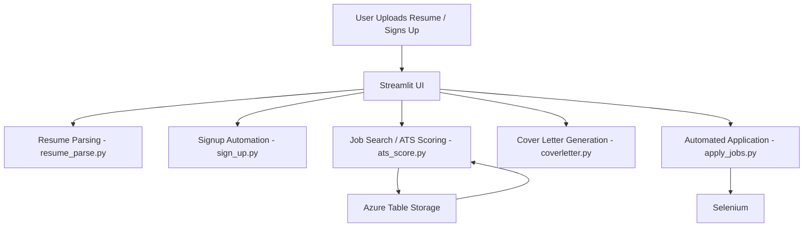

# Knowledge Transfer Document: Job Scraper Project

## Overview

This project is an automated job search, resume tailoring, and job application platform. It integrates with Azure Table Storage, uses Google Gemini LLM for AI-powered resume and cover letter generation, and automates job application processes using Selenium. The user interface is built with Streamlit.

---

## Project Structure & File Explanations

### 1. **filter_jobs.py**
- **Purpose:** Main Streamlit app for user signup, job search, resume upload, and job application.
- **Key Features:**
  - User signup/signin/logout.
  - Resume upload and parsing.
  - Job search with ATS (Applicant Tracking System) scoring.
  - AI-powered cover letter generation.
  - Automated job application via Selenium.
- **Technical Notes:** 
  - Uses Azure Table Storage for job data.
  - Integrates with Gemini API for AI tasks.
  - Handles OTP-based signup with Selenium.

### 2. **sign_up.py**
- **Purpose:** Automates the signup process on the Corazor job portal using Selenium.
- **Key Features:**
  - Fills signup form fields.
  - Waits for OTP input from the user.
  - Submits OTP and completes registration.
- **Technical Notes:** 
  - Designed to be called from the Streamlit app.
  - Waits in a loop until the OTP is provided.

### 3. **apply_jobs.py**
- **Purpose:** Automates the job application process on the Corazor portal using Selenium.
- **Key Features:**
  - Logs in to the portal.
  - Navigates to the job application form.
  - Fills out form fields using AI-generated answers.
  - Handles file uploads (resume, cover letter).
- **Technical Notes:** 
  - Uses the AnswerQuestions class for AI-generated answers.

### 4. **ats_score.py**
- **Purpose:** Calculates ATS score (resume-job match) and updates resumes using Gemini LLM.
- **Key Features:**
  - Compares resume text with job description.
  - Returns a similarity score.
  - Can generate an improved resume tailored to the job.
- **Technical Notes:** 
  - Uses the ResumeParse class for text cleaning and parsing.

### 5. **resume_parse.py**
- **Purpose:** Extracts text from PDF resumes and parses resume content using Gemini LLM.
- **Key Features:**
  - PDF text extraction.
  - Cleans and parses AI responses.
  - Extracts structured data (work experience, education, skills, etc.).
- **Technical Notes:** 
  - Used by multiple modules for resume processing.

### 6. **coverletter.py**
- **Purpose:** Generates a professional cover letter using resume and job description.
- **Key Features:**
  - Uses Gemini LLM to create a tailored cover letter.
  - Returns the cover letter as a formatted string.

### 7. **update_resume.py**
- **Purpose:** Enhances resumes by tailoring them to specific job descriptions.
- **Key Features:**
  - Uses ATS scoring and Gemini LLM to update resume content.
  - Generates PDF, LaTeX, and JSON versions of the resume.

### 8. **src/resume_generate.py**
- **Purpose:** Handles resume generation from text or JSON using LaTeX templates.
- **Key Features:**
  - Converts resume data to LaTeX and PDF.
  - Supports multiple templates and section ordering.
  - Saves resume in various formats.

### 9. **corazor_jobs.py**
- **Purpose:** Scrapes job listings from the Corazor portal and stores them in Azure Table Storage.
- **Key Features:**
  - Uses Gemini LLM to parse HTML and extract job data.
  - Stores jobs in Azure Table Storage.
  - Can delete old job entries in batches.

### 10. **fetch_jobsapi.py & filter_jobsapi.py**
- **Purpose:** Flask APIs for fetching and filtering jobs.
- **Key Features:**
  - `fetch_jobsapi.py`: Fetches jobs from a given URL and stores them in Azure.
  - `filter_jobsapi.py`: Filters jobs based on resume and search keyword.

### 11. **formquestions.py**
- **Purpose:** Selenium script to extract and answer dynamic form questions on job applications.
- **Key Features:**
  - Detects question types and fills them with dummy or AI-generated data.

### 12. **answer_questions.py**
- **Purpose:** Uses Gemini LLM to generate answers for job application questions based on resume content.

### 13. **utils.py**
- **Purpose:** Stores utility variables (e.g., preferred work type).

### 14. **app.py & fetch_app.py**
- **Purpose:** Streamlit apps for scraping and displaying jobs.
- **Key Features:**
  - `app.py`: Scrapes Google Careers and displays jobs.
  - `fetch_app.py`: Scrapes Corazor jobs and stores them in Azure.

### 15. **Other Files**
- **src/templates.py, src/prompt_engineering.py, src/render.py, doc_utils.py:** 
  - Handle LaTeX template management, prompt engineering for LLMs, PDF rendering, and document utilities.

---

## Technical Flow

1. **Job Scraping**
   - Jobs are scraped from Corazor or Google Careers using `corazor_jobs.py` or `app.py`.
   - Job data is parsed (using Gemini LLM for Corazor) and stored in Azure Table Storage.

2. **User Signup & Signin**
   - Users sign up via the Streamlit app (`filter_jobs.py`), which automates the portal signup using Selenium (`sign_up.py`).
   - OTP is handled interactively between Streamlit and Selenium.

3. **Resume Upload & Parsing**
   - Users upload their resume (PDF).
   - Text is extracted and parsed using `resume_parse.py`.

4. **Job Search & ATS Scoring**
   - Users search for jobs.
   - Each job is scored for ATS match using `ats_score.py` (Gemini LLM).
   - Jobs above a threshold are shown as matches.

5. **Cover Letter Generation**
   - Users can generate a cover letter for a job using `coverletter.py` (Gemini LLM).

6. **Automated Application**
   - Users can apply to jobs directly from the app.
   - Selenium (`apply_jobs.py`) automates the application process, filling out forms and uploading documents.

7. **Resume Enhancement**
   - Users can enhance their resume for a specific job using `update_resume.py` and `src/resume_generate.py`.

---

## Key Technologies

- **Streamlit:** User interface for all user interactions.
- **Selenium:** Automates browser actions for signup and job application.
- **Google Gemini LLM:** AI-powered resume parsing, ATS scoring, cover letter, and resume generation.
- **Azure Table Storage:** Stores job data for fast retrieval and filtering.
- **PyPDF2:** Extracts text from PDF resumes.
- **Flask:** Provides REST APIs for job fetching and filtering.

---

## Deployment & Environment

- **Environment Variables:** Store API keys and Azure connection strings in `.env`.
- **Dependencies:** See `requirements.txt` (not shown here, but should include streamlit, selenium, azure-data-tables, google-generativeai, PyPDF2, etc.).
- **Running the App:** Launch `filter_jobs.py` with Streamlit for the main UI.

---

## Project Flow Diagram

---

## Tips for Maintenance

- **Gemini API Quotas:** Handle rate limits and errors gracefully.
- **Selenium Stability:** Update XPaths/selectors if the target website changes.
- **Azure Table Storage:** Monitor for quota and performance.
- **Environment Variables:** Never hardcode secrets; always use `.env`.

---

## Contact

For further questions, contact the original developer or refer to the code comments for more details.
